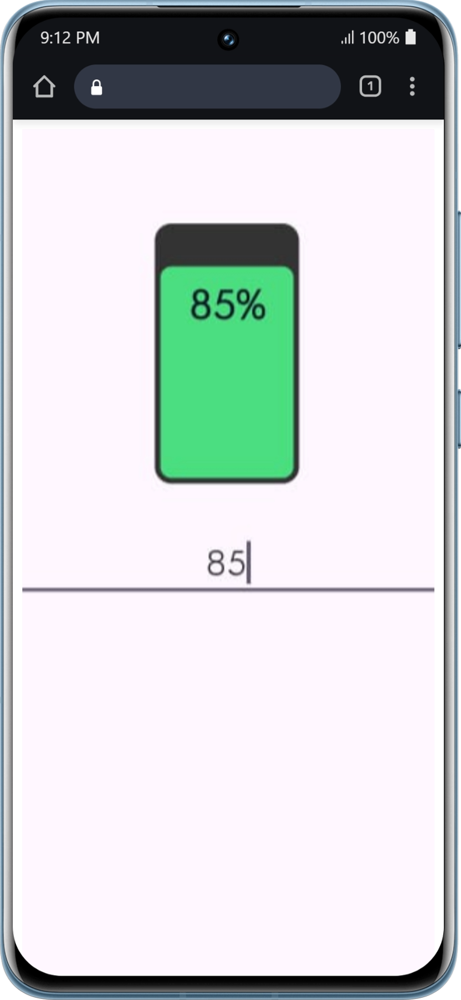
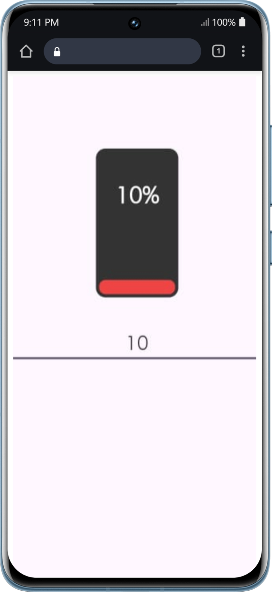

[](https://jitpack.io/#Team-Namah/batteryview-android)

# 🔋 BatteryView — Custom Android Battery Widget

BatteryView is a lightweight, modern **Android custom View library** that visually represents battery percentage using a clean vertical battery UI.

It is designed to be simple, fast, customizable, and production-ready — perfect for dashboards, system apps, IoT apps, health apps, and any Android application that needs a battery indicator.

---

## ✨ Features

- 🔋 Vertical battery UI with smooth Canvas rendering
- 🎨 Fully customizable colors via XML attributes
- 🧠 Automatic text color switching for better visibility
- 📏 Text scales automatically with view size
- 📐 Battery percentage text aligned at the top
- 🧪 Android Studio layout preview supported
- 🚀 Lightweight and dependency-free
- 🔒 Stable and locked public API

---

## 📦 Installation (via JitPack)

```gradle
repositories {
    maven { url "https://jitpack.io" }
}

dependencies {
    implementation "com.github.Team-Namah:batteryview-android:1.0.0"
}
```

---

## 📱 Demo Application (APK)

Try **BatteryView** without writing any code.

**Download Demo APK:**  
https://github.com/Team-Namah/batteryview-android/releases/latest

Demo app showcases:
- Live battery level updates
- Real-time color switching
- All supported XML attributes
- Dynamic text scaling behavior

---

## 🚀 Usage

```xml
<com.namah.batteryview.lib.BatteryView
    android:id="@+id/battery_view"
    android:layout_width="75dp"
    android:layout_height="135dp"
    app:batteryLevel="76"
    app:batteryBackgroundColor="#1F2937"
    app:batteryFillColor="#22C55E"
    app:batteryLowColor="#EF4444" />
```

```java
BatteryView batteryView = findViewById(R.id.battery_view);
batteryView.setBatteryLevel(85);
```

```kotlin
batteryView.setBatteryLevel(85)
```

---

## 🎨 Custom XML Attributes

| Attribute | Type | Description |
|---------|------|------------|
| batteryLevel | integer (0–100) | Initial battery percentage |
| batteryBackgroundColor | color | Battery body background color |
| batteryFillColor | color | Battery fill color |
| batteryLowColor | color | Battery color when level ≤ 20% |

---

## 🖼️ Output Preview




Text color automatically adapts based on fill overlap for maximum readability.

---

## 🤝 Contributing

Fork → Branch → Commit → Pull Request

---

## ⭐ Support

Star ⭐ the repository if you find it useful.

---

## 👨‍💻 Author

Mohit Ladhe  
Android Developer  
Team Namah

---

## 📄 License

MIT License

Copyright (c) 2026 Team Namah

Permission is hereby granted, free of charge, to any person obtaining a copy
of this software and associated documentation files (the "Software"), to deal
in the Software without restriction, including without limitation the rights
to use, copy, modify, merge, publish, distribute, sublicense, and/or sell
copies of the Software, and to permit persons to whom the Software is
furnished to do so, subject to the following conditions:

The above copyright notice and this permission notice shall be included in all
copies or substantial portions of the Software.

THE SOFTWARE IS PROVIDED "AS IS", WITHOUT WARRANTY OF ANY KIND.
